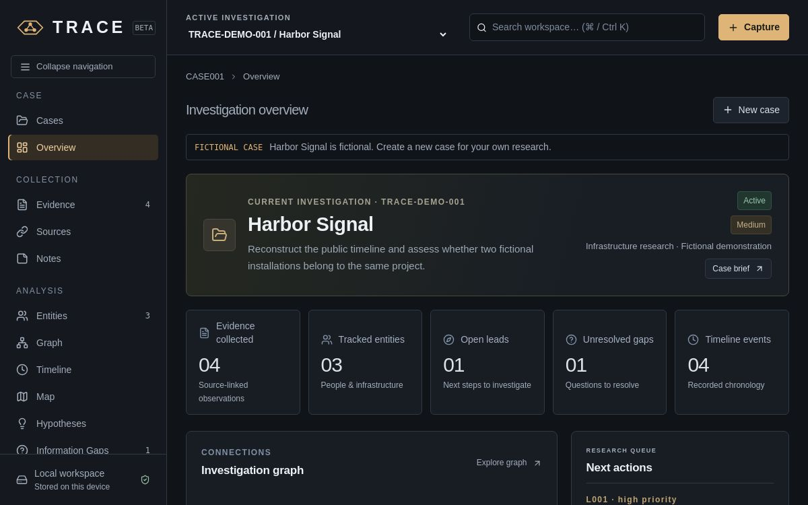

# TRACE

**Local-first open-source investigation workbench**

TRACE helps analysts collect evidence, preserve provenance, connect records, reconstruct timelines, and produce structured reports in one focused workspace.

Everything is stored locally in the browser. There is no account, backend, analytics, or automatic upload of investigation data.

## Live demo

[Open TRACE on GitHub Pages →](https://xxvxxvxxvxxv.github.io/trace-investigation-workbench/)



## Highlights

- Evidence, entities, sources, notes, leads, hypotheses, and information gaps
- Persistent desktop Record Inspector with linked-record history
- Relationship graph with search, filters, layouts, focus, and editing
- Qualified timeline with human-readable temporal gaps
- Privacy-conscious offline-coordinate map with optional online tiles
- OSINT tool library with categories, favorites, and provider links
- Printable analyst reports with attachment and SHA-256 appendices
- Local JSON backups with validation and atomic imports

## Built with

React · TypeScript · Vite · Dexie.js · Cytoscape.js · Leaflet · Vitest

## Run locally

Requirements: Node.js 22.13+ and npm.

```bash
npm ci
npm run dev
```

Open the local URL printed by Vite. To run the quality checks:

```bash
npm run format:check
npm run typecheck
npm run lint
npm test
npm run build
```

## Privacy model

- Records and attachments remain in browser IndexedDB.
- No cloud database, login, telemetry, or AI service is required.
- Backups are explicit JSON exports controlled by the analyst.
- Online map tiles are disabled by default and can be enabled deliberately.

## Project structure

```text
src/components   shared shell, inspector, editor, timeline
src/features     graph and map workspaces
src/pages        dashboard, records, reports, settings, ethics
src/db           Dexie database, migrations, integrity checks
src/models       typed records, relationships, validation, time
src/presentation UI adapters, columns, projections, formatting
src/styles       responsive visual system
e2e              portable Playwright smoke test
```

## Status

Current release: **v0.2.1-beta** · schema v2 · MIT licensed.

## Contributing

Use fictional fixtures only. Do not commit live investigation exports, personal data, credentials, or original evidence. See [CONTRIBUTING.md](CONTRIBUTING.md) and [SECURITY.md](SECURITY.md).

## License

[MIT](LICENSE)
